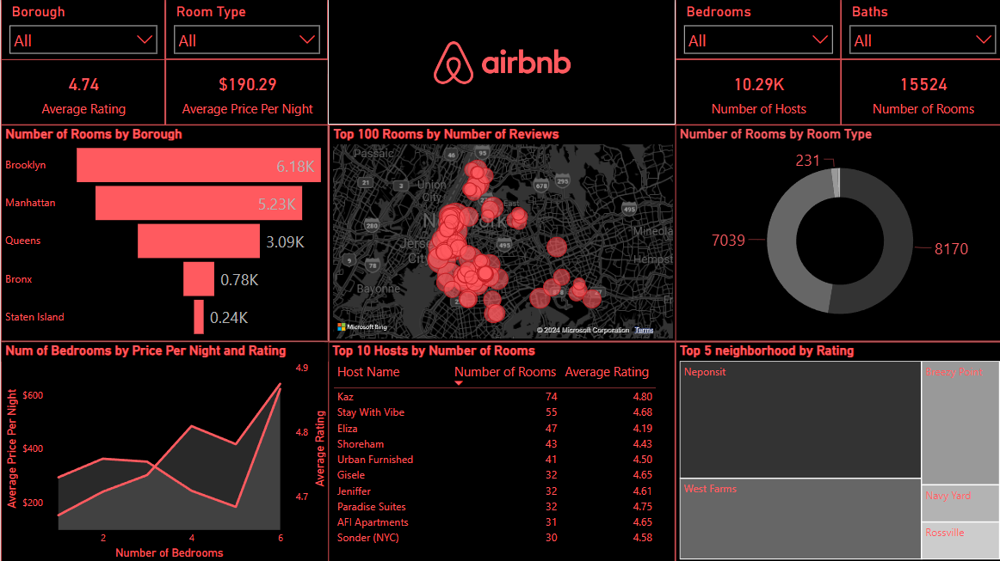

# NYC-Airbnb-Listings-Dashboard

This project involves the creation of an interactive Power BI dashboard for NYC Airbnb listings. The dashboard provides valuable insights into various aspects of Airbnb listings in New York City, including distribution by borough, host statistics, room types, prices, and ratings.

## Files in the Repository

- `new_york_listings_2024.csv`: The CSV file containing the raw data of Airbnb listings in New York City.
- `new_york_listings_2024_cleaned.csv`: The CSV file containing the cleaned data of Airbnb listings in New York City after preprocessing using Power Query Editor.
- `NYC_Airbnb_Listings_Dashboard.pbix`: The Power BI file containing the interactive dashboard.

## Dashboard Preview

## Dashboard Features

The Power BI dashboard includes the following visualizations and insights:

- **Borough Distribution**: A Slicer to select a Borough.
- **Room Type Distribution**: A Slicer to select a room type.
- **Bedrooms Type Distribution**: A Slicer to select a number of Bedrooms.
- **Baths Type Distribution**: A Slicer to select a number of Bathrooms.
- **Top 100 Rooms by Reviews**: A map showing the top 100 rooms based on the number of reviews.
- **Number of Bedrooms by Price Per Night and Rating**: A line chart showing the average price per night and average rating by the number of bedrooms.
- **Top 10 Hosts by Number of Rooms**: A table showing the top 10 hosts based on the number of rooms and their average rating.
- **Top 5 Neighborhoods by Rating**: A treemap showing the top 5 neighborhoods based on the average rating.
- **Number of Rooms by Room Type**: A donut chart showing the number of rooms by room type.
- **Number of Rooms by Borough**: A Funnel chart showing the number of rooms by Borough.

## Key Accomplishments

- Developed an interactive Power BI dashboard to visualize NYC Airbnb data, enhancing the decision-making process easier.
- Utilized Power Query Editor for data cleaning and transformation to ensure accurate and consistent data.
- Implemented DAX functions to create calculated columns and measures for insightful data analysis.

## How to Use

1. **Download the Preprocessed Dataset**: Download the `new_york_listings_2024_cleaned.csv` file and place it in an accessible directory.
2. **Open the Power BI File**: Open the `NYC_Airbnb_Listings_Dashboard.pbix` file using Power BI Desktop.
3. **Refresh Data**: In Power BI, go to the Home tab and click on the "Refresh" button to load the data from the CSV file into the dashboard.
4. **Interact with the Dashboard**: Explore the various visualizations and filters to gain insights into the Airbnb listings in New York City.

## Requirements

- **Power BI Desktop**: Ensure you have Power BI Desktop installed on your machine to open the `.pbix` file.
- **CSV File**: The `new_york_listings_2024_cleaned.csv` file should be in the same directory as the Power BI file or a location accessible to Power BI.
